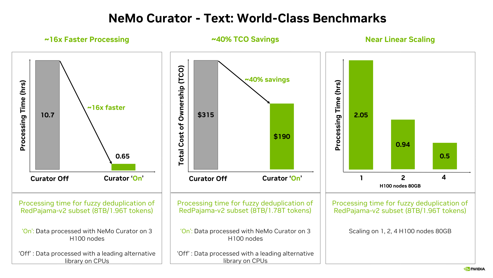
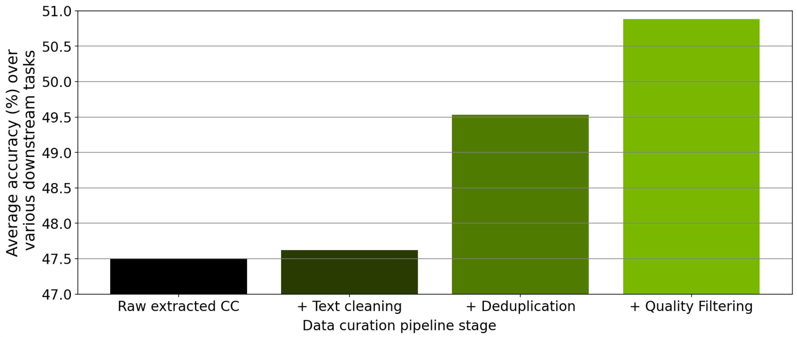

<div align="center">

  <a href="https://github.com/NVIDIA-NeMo/Curator/blob/main/LICENSE"></a>
  <a href="https://pypi.org/project/nemo-curator/"></a>
  <a href="https://github.com/NVIDIA-NeMo/Curator/graphs/contributors"></a>
  <a href="https://github.com/NVIDIA-NeMo/Curator/releases"></a>
  <a href="https://pypi.org/project/nemo-curator/"></a>

</div>

# NVIDIA NeMo Curator

**GPU-accelerated data curation for training better AI models, faster.** Scale from laptop to multi-node clusters with modular pipelines for text, images, video, and audio.

> *Part of the [NVIDIA NeMo](https://www.nvidia.com/en-us/ai-data-science/products/nemo/) software suite for managing the AI agent lifecycle.*

## What You Can Do

| Modality | Key Capabilities | Get Started |
|----------|-----------------|-------------|
| **Text** | Deduplication • Classification • Quality Filtering • Language Detection | [Text Guide](https://docs.nvidia.com/nemo/curator/latest/get-started/text.html) |
| **Image** | Aesthetic Filtering • NSFW Detection • Embedding Generation • Deduplication | [Image Guide](https://docs.nvidia.com/nemo/curator/latest/get-started/image.html) |
| **Video** | Scene Detection • Clip Extraction • Motion Filtering • Deduplication | [Video Guide](https://docs.nvidia.com/nemo/curator/latest/get-started/video.html) |
| **Audio** | ASR Transcription • Quality Assessment • WER Filtering | [Audio Guide](https://docs.nvidia.com/nemo/curator/latest/get-started/audio.html) |

## Quick Start

```bash
# Install for your modality
uv pip install "nemo-curator[text_cuda12]"

# Run the quickstart example
python tutorials/quickstart.py
```

**Full setup:** [Installation Guide](https://docs.nvidia.com/nemo/curator/latest/admin/installation.html) • [Docker](https://catalog.ngc.nvidia.com/orgs/nvidia/containers/nemo-curator) • [Tutorials](tutorials/)

---

## Features by Modality

### Text Curation

Process and curate high-quality text datasets for large language model (LLM) training with multilingual support.

| Category | Features | Documentation |
|----------|----------|---------------|
| **Data Sources** | Common Crawl • Wikipedia • ArXiv • Custom datasets | [Load Data](https://docs.nvidia.com/nemo/curator/latest/curate-text/load-data/index.html) |
| **Quality Filtering** | 30+ heuristic filters • fastText classification • GPU-accelerated classifiers for domain, quality, safety, and content type | [Quality Assessment](https://docs.nvidia.com/nemo/curator/latest/curate-text/process-data/quality-assessment/heuristic.html) |
| **Deduplication** | Exact • Fuzzy (MinHash LSH) • Semantic (GPU-accelerated) | [Deduplication](https://docs.nvidia.com/nemo/curator/latest/curate-text/process-data/deduplication/index.html) |
| **Processing** | Text cleaning • Language identification | [Content Processing](https://docs.nvidia.com/nemo/curator/latest/curate-text/process-data/content-processing/text-cleaning.html) |

---

### Image Curation

Curate large-scale image datasets for vision language models (VLMs) and generative AI training.

| Category | Features | Documentation |
|----------|----------|---------------|
| **Data Loading** | WebDataset format • Large-scale image-text pairs | [Load Data](https://docs.nvidia.com/nemo/curator/latest/curate-images/load-data/index.html) |
| **Embeddings** | CLIP embeddings for semantic analysis | [Embeddings](https://docs.nvidia.com/nemo/curator/latest/curate-images/process-data/embeddings/index.html) |
| **Filtering** | Aesthetic quality scoring • NSFW detection | [Filters](https://docs.nvidia.com/nemo/curator/latest/curate-images/process-data/filters/index.html) |

---

### Video Curation

Process large-scale video corpora with distributed, GPU-accelerated pipelines for world foundation models (WFMs).

| Category | Features | Documentation |
|----------|----------|---------------|
| **Data Loading** | Local paths • S3-compatible storage • HTTP(S) URLs | [Load Data](https://docs.nvidia.com/nemo/curator/latest/curate-video/load-data/index.html) |
| **Clipping** | Fixed-stride splitting • Scene-change detection (TransNetV2) | [Clipping](https://docs.nvidia.com/nemo/curator/latest/curate-video/process-data/clipping.html) |
| **Processing** | GPU H.264 encoding • Frame extraction • Motion filtering • Aesthetic filtering | [Processing](https://docs.nvidia.com/nemo/curator/latest/curate-video/process-data/filtering.html) |
| **Embeddings** | InternVideo2 and Cosmos-Embed1 for clip-level embeddings | [Embeddings](https://docs.nvidia.com/nemo/curator/latest/curate-video/process-data/embeddings.html) |
| **Deduplication** | K-means clustering • Pairwise similarity for near-duplicates | [Deduplication](https://docs.nvidia.com/nemo/curator/latest/curate-video/process-data/dedup.html) |

---

### Audio Curation

Prepare high-quality speech datasets for automatic speech recognition (ASR) and multimodal AI training.

| Category | Features | Documentation |
|----------|----------|---------------|
| **Data Loading** | Local files • Custom manifests • Public datasets (FLEURS) | [Load Data](https://docs.nvidia.com/nemo/curator/latest/curate-audio/load-data/index.html) |
| **ASR Processing** | NeMo Framework pretrained models • Automatic transcription | [ASR Inference](https://docs.nvidia.com/nemo/curator/latest/curate-audio/process-data/asr-inference/index.html) |
| **Quality Assessment** | Word Error Rate (WER) calculation • Duration analysis • Quality-based filtering | [Quality Assessment](https://docs.nvidia.com/nemo/curator/latest/curate-audio/process-data/quality-assessment/index.html) |
| **Integration** | Text curation workflow integration for multimodal pipelines | [Text Integration](https://docs.nvidia.com/nemo/curator/latest/curate-audio/process-data/text-integration/index.html) |

---

## Why NeMo Curator?

### Performance at Scale

NeMo Curator leverages NVIDIA RAPIDS™ libraries such as cuDF, cuML, and cuGraph along with Ray to scale workloads across multi-node, multi-GPU environments.

**Proven Results:**
- **16× faster** fuzzy deduplication on 8 TB RedPajama v2 (1.78 trillion tokens)
- **40% lower** total cost of ownership (TCO) compared to CPU-based alternatives
- **Near-linear scaling** from one to four H100 80 GB nodes (2.05 hrs → 0.50 hrs)

<p align="center">
  
</p>

### Quality Improvements

Data curation modules measurably improve model performance. In ablation studies using a 357M-parameter GPT model trained on curated Common Crawl data:

<p align="center">
  
</p>

**Results:** Progressive improvements in zero-shot downstream task performance through text cleaning, deduplication, and quality filtering stages.

---

## Learn More

| Resource | Links |
|----------|-------|
| **Documentation** | [Main Docs](https://docs.nvidia.com/nemo/curator/latest/) • [API Reference](https://docs.nvidia.com/nemo/curator/latest/apidocs/index.html) • [Concepts](https://docs.nvidia.com/nemo/curator/latest/about/concepts/index.html) |
| **Tutorials** | [Text](tutorials/text/) • [Image](tutorials/image/) • [Video](tutorials/video/) • [Audio](tutorials/audio/) |
| **Deployment** | [Installation](https://docs.nvidia.com/nemo/curator/latest/admin/installation.html) • [Infrastructure](https://docs.nvidia.com/nemo/curator/latest/reference/infrastructure/index.html) |
| **Community** | [GitHub Discussions](https://github.com/NVIDIA-NeMo/Curator/discussions) • [Issues](https://github.com/NVIDIA-NeMo/Curator/issues) |

---

## Contribute

We welcome community contributions! Please refer to [CONTRIBUTING.md](https://github.com/NVIDIA/NeMo/blob/stable/CONTRIBUTING.md) for guidelines.
