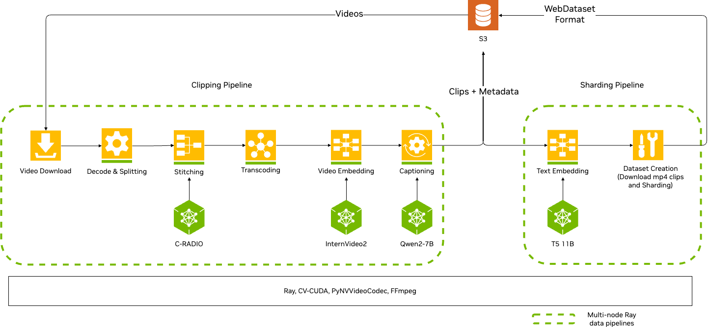

(about-concepts-video-architecture)=
# Architecture

NeMo Curator's video curation system is built on top of Ray, a distributed computing framework that enables scalable, high-throughput data processing across clusters of machines.

## Ray Foundation

NeMo Curator leverages two essential Ray Core capabilities:

- **Distributed Actor Management**: Creates and manages Ray actors across a cluster, with each actor running in a specific conda environment. This allows for flexible, isolated execution of different pipeline stages.
- **Global Shared Memory**: Enables efficient data passing between actors through object references, minimizing data movement and maximizing throughput.

## Autoscaling

During streaming execution, NeMo Curator's autoscaler:

- Monitors each stage's throughput
- Dynamically adjusts worker allocation
- Optimizes overall pipeline performance by balancing resources across stages

This dynamic scaling ensures that bottlenecks are minimized and hardware is used efficiently, especially for large-scale video curation tasks. 